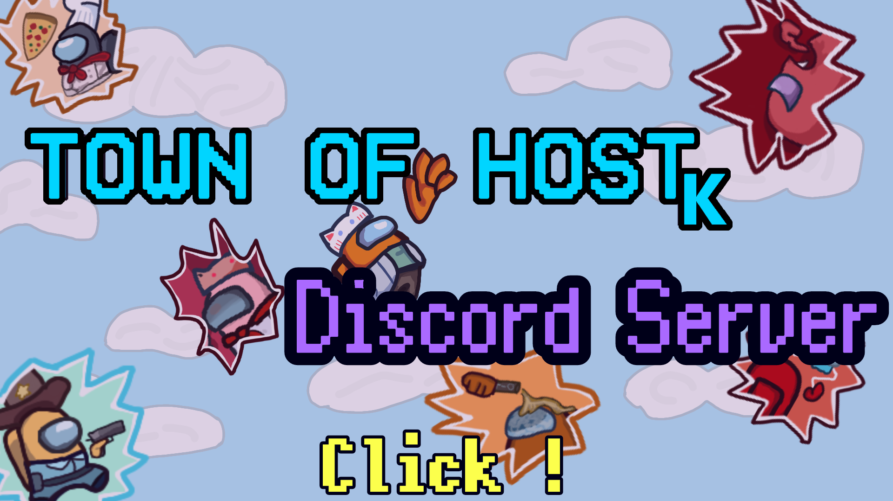

# Town Of Host-K

**DiscordServer**

## この Mod について

この Mod は非公式のものであり、この Mod の開発に関して Among Us の開発元である"Innersloth"は一切関与していません。 
この Mod の問題などに関して公式に問い合わせないでください。 

この Mod はTOHに役職や機能など追加したModです
TOH-Kで起きたバグは本家や他MODには報告しないでまずはkに報告してください。 

また、TOH-Kに関する質問、バグ報告は基本、[DiscordServer](https://discord.gg/5DPqH8seFq)でのみ受け付けております。 

機能面などを開発者にDMで聞くのは超大迷惑なので基本おやめください。 

[本家TOHはこちら](https://github.com/tukasa0001/TownOfHost) TOH-K以外の説明を省いているので本家の役職などはこちらから

## [Wiki](https://github.com/KYMario/TownOfHost-K/wiki)もあるよ!

## リリース

AmongUsバージョン : **2024.8.13**~ 

**最新版は[こちら](https://github.com/KYMario/TownOfHost-K/releases/latest)**

過去バージョンは[こちら](https://github.com/KYMario/TownOfHost-K/releases)

## 公開ルームについて
> [!Note]
> 現在のバージョンではAmongUs公式よりバニラサーバーで公開ルームを開くことができません。

> [**Note**]
> - 【理由】
> - 以前からHostMod(Moed含む)部屋での仕様, 不具合がAmongUs公式に問い合わせが多数寄せられた事が主な原因と捉えています。
> - また、ユーザーが**意図しないMod体験**が行われないよう注意喚起をしています。
 
-これは永続的な変更では有りません。 
-非公開ルームへの影響は有りません。 
-カスタムサーバーの影響は有りません。 
●公開ルームが開けない等のお問い合わせはご遠慮ください

## 勧誘部屋を開く又は勧誘する,勧誘からの参加は厳禁です。
**禁止行為**
> [**Note**]
> - ・非公開でMod部屋を建て,その部屋へのコードを公開ルームで伝え公開ルーム利用者がその部屋に参加する可能性がある行為。
> - (例)
> - 部屋主がサブ垢等で公開ルームを建てそこから非公開ルームへ勧誘する行為
> - 参加者がサブ垢等で公開ルームを建てそこから非公開ルームへ勧誘する行為
> - 部屋主,参加者が公開ルームへ参加し、そこから非公開ルームへ勧誘する行為

=>　公開ルーム利用者が意図しないMod体験を行われないようにするためです。 
**禁止されない行為**
> [**Note**]
> - Discordや村のオープンチャットで非公開ルームのコードを伝え身内間でMod部屋を開催
> - Town Of Host-Kのマッチメイキングでの募集
> - Youtubeなどの配信サイトで上記の禁止行為に該当しない参加型/身内村配信 

=>　要するに**Modだと認知していない野良のプレイヤーが交わる可能性がある**とアウトです。 
 
勧誘部屋に遭遇した場合は勧誘先に無闇に参加せずまずは開発者にお知らせください。厳正に対処いたします。 

## TOH-Kでの処罰、利用不可について
v.5.1.61.1以降より[SuperNewRoles](https://github.com/SuperNewRoles/SuperNewRoles/)様等一部のModに搭載されていた 
ブラックリストをTown Of Host-Kでも適応するようにいたしました。 

> [!note]
> - 【処罰に値する利用方法】
> - ・上記に記載している勧誘部屋,勧誘行為に値する行動を行った場合
> - ・開発者が不適切かつ処罰するに値する迷惑行為を行った場合

上記に当てはまるプレイヤーはMod開発者の判断によりブラックリストに追加されます。 
**ブラックリストを適応しているMod部屋に永久もしくは一時的に参加/主催することが出来ません。** 

**★また、ブラックリスト追加により,ルーム作成にフレンドコードが必須となりました。ご了承ください。★** 

-----------------------------------------------

**【絶対に読むんだ】** 
Town Of Host-Kの利用をもって"処罰に値する利用方法"内で記載されている 
行動をしないと誓い, 
処罰に値する利用を行った場合はいかなる場合でも処罰を受け入れるものとします。 

-----------------------------------------------

要するに 
上の【処罰に値する利用方法】の行動をしたら 
Modが使えなくなるよ! 
このMod使うならMod使えなくなっても受け入れるし、 
その処罰に値する利用方法をしないよ！！ 
ってことです。

## TownOfHost-Kってなんだい?
他のAmongUsのModとはまた一味違った、斬新で独特な機能や役職が多いModです。 

HostModなので部屋主のみModを導入すれば、 
参加者はModを導入する必要もカスタムサーバー追加等の面倒な手間なしで 
導入者が部屋を建て、その部屋に入ることでTownOfHost-Kを遊ぶことができます！ 

詳しい仕様などは[Wiki](https://github.com/KYMario/TownOfHost-K/wiki)やゲーム内確認できます 

## Mod役職について
※wikiページに飛びます 

インポスター役職

- [エイリアン](https://github.com/KYMario/TownOfHost-K/wiki/エイリアン)
- [ジャンパー](https://github.com/KYMario/TownOfHost-K/wiki/ジャンパー)
- [イビルギャンブラー](https://github.com/KYMario/TownOfHost-K/wiki/イビルギャンブラー)
- [イビルアドナー](https://github.com/KYMario/TownOfHost-K/wiki/イビルアドナー)
- [イビルハッカー](https://github.com/KYMario/TownOfHost-K/wiki/イビルハッカー)
- [イビルトラッカー](https://github.com/KYMario/TownOfHost-K/wiki/イビルトラッカー)
- [イビルサテライト](https://github.com/KYMario/TownOfHost-K/wiki/イビルサテライト)
- [イビルテラー](https://github.com/KYMario/TownOfHost-K/wiki/イビルテラー)
- [イビルメーカー](https://github.com/KYMario/TownOfHost-K/wiki/イビルメーカー)
- [アンチレポーター](https://github.com/KYMario/TownOfHost-K/wiki/アンチレポーター)
- [爆弾魔](https://github.com/KYMario/TownOfHost-K/wiki/爆弾魔)
- [モグラ](https://github.com/KYMario/TownOfHost-K/wiki/モグラ)
- [ノーティファー](https://github.com/KYMario/TownOfHost-K/wiki/ノーティファー)
- [プログレスキラー](https://github.com/KYMario/TownOfHost-K/wiki/プログレスキラー)
- [リローダー](https://github.com/KYMario/TownOfHost-K/wiki/リローダー)
- [大狼](https://github.com/KYMario/TownOfHost-K/wiki/大狼)
- [テレポートキラー](https://github.com/KYMario/TownOfHost-K/wiki/テレポートキラー)
- [一途な狼](https://github.com/KYMario/TownOfHost-K/wiki/一途な狼)
- [デクレッシェンド](https://github.com/KYMario/TownOfHost-K/wiki/デクレッシェンド)
- [コネクトセーバー](https://github.com/KYMario/TownOfHost-K/wiki/コネクトセーバー)
- [リミッター](https://github.com/KYMario/TownOfHost-K/wiki/リミッター)
- [マジシャン](https://github.com/KYMario/TownOfHost-K/wiki/マジシャン)
- [カモフラージャー](https://github.com/KYMario/TownOfHost-K/wiki/カモフラージャー)
- [記憶喪失者](https://github.com/KYMario/TownOfHost-K/wiki/記憶喪失者)
- [カーサー](https://github.com/KYMario/TownOfHost-K/wiki/カーサー)
- [プロボーラー](https://github.com/KYMario/TownOfHost-K/wiki/プロボーラー)
- [イレイサー](https://github.com/KYMario/TownOfHost-K/wiki/イレイサー)
- [シリアルキラー](https://github.com/KYMario/TownOfHost-K/wiki/シリアルキラー)
- [バウンティハンター](https://github.com/KYMario/TownOfHost-K/wiki/バウンティハンター)
- [インサイダー](https://github.com/KYMario/TownOfHost-K/wiki/インサイダー)
- [メアー](https://github.com/KYMario/TownOfHost-K/wiki/メアー)
- [ヴァンパイア](https://github.com/KYMario/TownOfHost-K/wiki/ヴァンパイア)
- [パペッティア](https://github.com/KYMario/TownOfHost-K/wiki/パペッティア)
- [マフィア](https://github.com/KYMario/TownOfHost-K/wiki/マフィア)
- [ペンギン](https://github.com/KYMario/TownOfHost-K/wiki/ペンギン)
- [ネコカボチャ](https://github.com/KYMario/TownOfHost-K/wiki/ネコカボチャ)
- [シェイプマスター](https://github.com/KYMario/TownOfHost-K/wiki/シェイプマスター)
- [スナイパー](https://github.com/KYMario/TownOfHost-K/wiki/スナイパー)
- [タイムシーフ](https://github.com/KYMario/TownOfHost-K/wiki/タイムフシーフ)
- [ウォーロック](https://github.com/KYMario/TownOfHost-K/wiki/ウォーロック)
- [ウィッチ](https://github.com/KYMario/TownOfHost-K/wiki/ウィッチ)
- [ステルス](https://github.com/KYMario/TownOfHost-K/wiki/ステルス)
- [花火職人](https://github.com/KYMario/TownOfHost-K/wiki/花火職人)

マッドメイト

- [マッドメイト](https://github.com/KYMario/TownOfHost-K/wiki/マッドメイト)
- [マッドスニッチ](https://github.com/KYMario/TownOfHost-K/wiki/マッドスニッチ)
- [マッドガーディアン](https://github.com/KYMario/TownOfHost-K/wiki/マッドガーディアン)
- [マッドベイト](https://github.com/KYMario/TownOfHost-K/wiki/マッドベイト)
- [マッドチェンジャー](https://github.com/KYMario/TownOfHost-K/wiki/マッドチェンジャー)
- [マッドトラッカー](https://github.com/KYMario/TownOfHost-K/wiki/マッドトラッカー)
- [マッドスーサイド](https://github.com/KYMario/TownOfHost-K/wiki/マッドスーサイド)
- [マッドテラー](https://github.com/KYMario/TownOfHost-K/wiki/マッドテラー)
- [マッドリデュース](https://github.com/KYMario/TownOfHost-K/wiki/マッドリデュース)
- [マッドアベンジャー](https://github.com/KYMario/TownOfHost-K/wiki/マッドアベンジャー)
- [マッドジェスター](https://github.com/KYMario/TownOfHost-K/wiki/マッドジェスター)
- [マッドワーカー](https://github.com/KYMario/TownOfHost-K/wiki/)
- [サイドキックマッドメイト](https://github.com/KYMario/TownOfHost-K/wiki/)

クルーメイト

- [ナイスアドナー](https://github.com/KYMario/TownOfHost-K/wiki/ナイスアドナー)
- [ナイスロガー](https://github.com/KYMario/TownOfHost-K/wiki/ナイスロガー)
- [シェリフ](https://github.com/KYMario/TownOfHost-K/wiki/シェリフ)
- [スイッチシェリフ](https://github.com/KYMario/TownOfHost-K/wiki/スイッチシェリフ)
- [ミーティングシェリフ](https://github.com/KYMario/TownOfHost-K/wiki/ミーティングシェリフ)
- [狼少年](https://github.com/KYMario/TownOfHost-K/wiki/狼少年)
- [占い師](https://github.com/KYMario/TownOfHost-K/wiki/占い師)
- [かけだし占い師](https://github.com/KYMario/TownOfHost-K/wiki/かけだし占い師)
- [ぽんこつ占い師](https://github.com/KYMario/TownOfHost-K/wiki/ぽんこつ占い師)
- [巫女](https://github.com/KYMario/TownOfHost-K/wiki/巫女)
- [ホワイトハッカー](https://github.com/KYMario/TownOfHost-K/wiki/ホワイトハッカー)
- [ディクテーター](https://github.com/KYMario/TownOfHost-K/wiki/ディクテーター)
- [天秤](https://github.com/KYMario/TownOfHost-K/wiki/天秤)
- [タスクスター](https://github.com/KYMario/TownOfHost-K/wiki/タスクスター)
- [ウルトラスター](https://github.com/KYMario/TownOfHost-K/wiki/ウルトラスター)
- [ベイト](https://github.com/KYMario/TownOfHost-K/wiki/ベイト)
- [インセンダー](https://github.com/KYMario/TownOfHost-K/wiki/インセンダー)
- [トラッパー](https://github.com/KYMario/TownOfHost-K/wiki/トラッパー)
- [ドクター](https://github.com/KYMario/TownOfHost-K/wiki/ドクター)
- [サイキック](https://github.com/KYMario/TownOfHost-K/wiki/サイキック)
- [シーア](https://github.com/KYMario/TownOfHost-K/wiki/シーア)
- [ライター](https://github.com/KYMario/TownOfHost-K/wiki/ライター)
- [パン屋](https://github.com/KYMario/TownOfHost-K/wiki/パン屋)
- [エフィシェンシー](https://github.com/KYMario/TownOfHost-K/wiki/エフィシェンシー)
- [メイヤー](https://github.com/KYMario/TownOfHost-K/wiki/メイヤー)
- [サボタージュマスター](https://github.com/KYMario/TownOfHost-K/wiki/サボタージュマスター)
- [スピードブースター](https://github.com/KYMario/TownOfHost-K/wiki/スピードブースター)
- [君臨者](https://github.com/KYMario/TownOfHost-K/wiki/君臨者)
- [スニッチ](https://github.com/KYMario/TownOfHost-K/wiki/スニッチ)
- [ストルナー](https://github.com/KYMario/TownOfHost-K/wiki/ストルナー)
- [雪だるま](https://github.com/KYMario/TownOfHost-K/wiki/雪だるま)
- [ギャスプ](https://github.com/KYMario/TownOfHost-K/wiki/ギャスプ)
- [シャイボーイ](https://github.com/KYMario/TownOfHost-K/wiki/シャイボーイ)
- [スタッフ](https://github.com/KYMario/TownOfHost-K/wiki/スタッフ)
- [アンドロイド](https://github.com/KYMario/TownOfHost-K/wiki/アンドロイド)
- [カムバッカー](https://github.com/KYMario/TownOfHost-K/wiki/カムバッカー)
- [ベントマスター](https://github.com/KYMario/TownOfHost-K/wiki/ベントマスター)
- [トイレファン](https://github.com/KYMario/TownOfHost-K/wiki/トイレファン)
- [ベントオープナー](https://github.com/KYMario/TownOfHost-K/wiki/ベントオープナー)
- [ベントハンター](https://github.com/KYMario/TownOfHost-K/wiki/ベントハンター)

ニュートラル

- [ジャッカル](https://github.com/KYMario/TownOfHost-K/wiki/ジャッカル)
- [ジャッカルエイリアン](https://github.com/KYMario/TownOfHost-K/wiki/ジャッカルエイリアン)
- [ジャッカルマフィア](https://github.com/KYMario/TownOfHost-K/wiki/ジャッカルマフィア)
- [ジャッカルドール](https://github.com/KYMario/TownOfHost-K/wiki/ジャッカルドール)
- [エゴイスト](https://github.com/KYMario/TownOfHost-K/wiki/エゴイスト)
- [リモートキラー](https://github.com/KYMario/TownOfHost-K/wiki/リモートキラー)
- [死神](https://github.com/KYMario/TownOfHost-K/wiki/死神)
- [ドッペルゲンガー](https://github.com/KYMario/TownOfHost-K/wiki/ドッペルゲンガー)
- [カウントキラー](https://github.com/KYMario/TownOfHost-K/wiki/カウントキラー)
- [バンカー](https://github.com/KYMario/TownOfHost-K/wiki/バンカー)
- [アーソニスト](https://github.com/KYMario/TownOfHost-K/wiki/アーソニスト)
- [シェフ](https://github.com/KYMario/TownOfHost-K/wiki/シェフ)
- [ペスト医師](https://github.com/KYMario/TownOfHost-K/wiki/ペスト医師)
- [カースメーカー](https://github.com/KYMario/TownOfHost-K/wiki/カースメーカー)
- [エクスキューショナー](https://github.com/KYMario/TownOfHost-K/wiki/エクスキューショナー)
- [ジェスター](https://github.com/KYMario/TownOfHost-K/wiki/ジェスター)
- [マドンナ](https://github.com/KYMario/TownOfHost-K/wiki/マドンナ)
- [マスメディア](https://github.com/KYMario/TownOfHost-K/wiki/マスメディア)
- [モノクラー](https://github.com/KYMario/TownOfHost-K/wiki/モノクラー)
- [怪盗](https://github.com/KYMario/TownOfHost-K/wiki/怪盗)
- [テロリスト](https://github.com/KYMario/TownOfHost-K/wiki/テロリスト)
- [ワーカホリック](https://github.com/KYMario/TownOfHost-K/wiki/ワーカホリック)
- [妖狐](https://github.com/KYMario/TownOfHost-K/wiki/妖狐)
- [サンタクロース](https://github.com/KYMario/TownOfHost-K/wiki/サンタクロース)
- [ヴァルチャー](https://github.com/KYMario/TownOfHost-K/wiki/ヴァルチャー)
- [シュレディンガーの猫](https://github.com/KYMario/TownOfHost-K/wiki/シュレディンガーの猫)
- [バケネコ](https://github.com/KYMario/TownOfHost-K/wiki/バケネコ)
- [オポチュニスト](https://github.com/KYMario/TownOfHost-K/wiki/オポチュニスト)
- [裏切者](https://github.com/KYMario/TownOfHost-K/wiki/裏切者)

コンビネーション

- [ドライバーとブレイド](https://github.com/KYMario/TownOfHost-K/wiki/ドライバーとブレイド)

属性

- [片思い](https://github.com/KYMario/TownOfHost-K/wiki/片思い)
- [ラバーズ](https://github.com/KYMario/TownOfHost-K/wiki/ラバーズ)
- [天邪鬼](https://github.com/KYMario/TownOfHost-K/wiki/天邪鬼)
- [ラストインポスター](https://github.com/KYMario/TownOfHost-K/wiki/ラストインポスター)
- [ラストニュートラル](https://github.com/KYMario/TownOfHost-K/wiki/ラストニュートラル)
- [ワークホース](https://github.com/KYMario/TownOfHost-K/wiki/ワークホース)
- [ゲッサー](https://github.com/KYMario/TownOfHost-K/wiki/ゲッサー)
- [シリアル](https://github.com/KYMario/TownOfHost-K/wiki/シリアル)
- [マジックハンド](https://github.com/KYMario/TownOfHost-K/wiki/マジックハンド)
- [コネクティング](https://github.com/KYMario/TownOfHost-K/wiki/コネクティング)
- [ウォッチング](https://github.com/KYMario/TownOfHost-K/wiki/ウォッチング)
- [プラスポート](https://github.com/KYMario/TownOfHost-K/wiki/プラスポート)
- [タイブレーカー](https://github.com/KYMario/TownOfHost-K/wiki/タイブレーカー)
- [オートプシー](https://github.com/KYMario/TownOfHost-K/wiki/オートプシー)
- [リベンジャー](https://github.com/KYMario/TownOfHost-K/wiki/リベンジャー)
- [スピーディング](https://github.com/KYMario/TownOfHost-K/wiki/スピーディング)
- [ガーディング](https://github.com/KYMario/TownOfHost-K/wiki/ガーディング)
- [マネジメント](https://github.com/KYMario/TownOfHost-K/wiki/マネジメント)
- [シーイング](https://github.com/KYMario/TownOfHost-K/wiki/シーイング)
- [オープナー](https://github.com/KYMario/TownOfHost-K/wiki/オープナー)
- [ライティング](https://github.com/KYMario/TownOfHost-K/wiki/ライティング)
- [ムーン](https://github.com/KYMario/TownOfHost-K/wiki/ムーン)
- [アムネシア](https://github.com/KYMario/TownOfHost-K/wiki/アムネシア)
- [スロースターター](https://github.com/KYMario/TownOfHost-K/wiki/スロースターター)
- [ノットヴォウター](https://github.com/KYMario/TownOfHost-K/wiki/ノットヴォウター)
- [イレクター](https://github.com/KYMario/TownOfHost-K/wiki/イレクター)
- [インフォプアー](https://github.com/KYMario/TownOfHost-K/wiki/インフォプアー)
- [ノンレポート](https://github.com/KYMario/TownOfHost-K/wiki/ノンレポート)
- [トランスパレント](https://github.com/KYMario/TownOfHost-K/wiki/トランスパレント)
- [ウォーター](https://github.com/KYMario/TownOfHost-K/wiki/ウォーター)
- [クラムシー](https://github.com/KYMario/TownOfHost-K/wiki/クラムシー)
- [スラッカー](https://github.com/KYMario/TownOfHost-K/wiki/スラッカー)

幽霊役職

- [ゲームマスター](https://github.com/KYMario/TownOfHost-K/wiki/ゲームマスター)
- [デーモントラッカー](https://github.com/KYMario/TownOfHost-K/wiki/デーモントラッカー)
- [デーモンクラッシャー](https://github.com/KYMario/TownOfHost-K/wiki/デーモンクラッシャー)
- [デーモンベンター](https://github.com/KYMario/TownOfHost-K/wiki/デーモンベンター)
- [アシスティングエンジェル](https://github.com/KYMario/TownOfHost-K/wiki/アシスティングエンジェル)
- [ゴーストボタナー](https://github.com/KYMario/TownOfHost-K/wiki/ゴーストボタナー)
- [ゴーストノイズセンダー](https://github.com/KYMario/TownOfHost-K/wiki/ゴーストノイズセンダー)
- [ゴーストリセッター](https://github.com/KYMario/TownOfHost-K/wiki/ゴーストリセッター)
- [守護天使](https://github.com/KYMario/TownOfHost-K/wiki/守護天使)

## 機能,モードについて

モード

- [スタンダード](https://github.com/KYMario/TownOfHost-K/wiki/スタンダード)
- - [役職入りかくれんぼ](https://github.com/KYMario/TownOfHost-K/wiki/役職入りかくれんぼ)
- - [サドンデスモード](https://github.com/KYMario/TownOfHost-K/wiki/サドンデスモード)
- [かくれんぼ](https://github.com/KYMario/TownOfHost-K/wiki/かくれんぼ)
- [タスクバトル](https://github.com/KYMario/TownOfHost-K/wiki/タスクバトル)

## 機能

### テンプレート
定型文を送信できる機能です。 

| タグ           | シーン                      | 対象               |
| -------------- | --------------------------- | ------------------ |
| start          | ゲーム開始のカウントダウン前 | 全員 |

#### 変数展開

| 変数名               | 内容                       |
| -------------------- | ------------------------- |
| Timer                | 部屋が落ちるまでのタイマー  |
| Roles                | 有効な役職を表示           |
| ModColor             | Modのカラーコード          |

### 読み上げ機能
棒読みちゃんを使用してチャットを読み上げることができる機能です 
コマンドで声を設定することができます 

**[使い方] /voice <音質> <音量> <速度> <音程>** 
**[音質一覧を確認] /voice get**

> **Note**
> - 棒読みちゃんを起動してる時のみ読み上げ設定をONにしてください (自動でOFFになります)
> - [TOHK_DATA\options.txt](#オプションファイル)からポートを設定できます。

### 各役職の超簡易的な説明

インポスター役職

- エイリアン `毎ターン能力が変わる`
- ジャンパー `指定した場所に爆発を起こしながらジャンプする`
- イビルギャンブラー `確率でキルクールが速くなる`
- イビルアドナー `属性が付与されている`
- イビルハッカー `アドミン情報が分かる`
- イビルトラッカー `プレイヤーを追跡する`
- イビルサテライト `プレイヤーの経路を調査する`
- イビルテラー `近付き役職を占う`
- イビルメーカー `マッドを作れ`
- アンチレポーター `レポートを一定時間防ぐ`
- 爆弾魔 `爆弾を渡そう`
- モグラ `ランダムなベントに飛ぼう`
- ノーティファー `キルすると確率で全員にキルフラッシュが`
- プログレスキラー `タスクを終えた人を探そう`
- リローダー `キルクールをリロードしよう`
- 大狼 `シェリフ、占い師を騙せ`
- テレポートキラー `テレポートキルをして混乱させろ`
- 一途な狼 `オーバーキルで相手の能力を封じ込め`
- デクレッシェンド `だんだんよわくなぁる`
- コネクトセーバー `2人を接続しダブルキルを通せ`
- リミッター `力尽きるまでに場をあらせ`
- マジシャン `なんと...死体が無くなっちゃいました～！`
- カモフラージャー `全員の姿を同じにして混乱させろ`
- 記憶喪失者 `僕はシェリフだよ！ん?`
- カーサー `呪いを駆使しキルを進めよ`
- プロボーラー `死体を穴に飛ばそう`
- イレイサー `他人の役職を消しちゃおう!`
- シリアルキラー `キルをし続けないと死んでしまう`
- バウンティハンター `獲物を狩りキルしまくれ`
- インサイダー `霊の役職を知れ`
- メアー `停電にすんごく強いインポスター`
- ヴァンパイア `相手を噛んで遅延キルをしろ`
- パペッティア `相手を操り相手にキルさせろ`
- マフィア `インポスターが減るまで白くなれ`
- ペンギン `獲物を拉致しばれない位置でキルしろ`
- ネコカボチャ `キルされたらキルし返す`
- シェイプマスター `シェイプシフトの使い手`
- スナイパー `クルーを狙撃せよ`
- タイムフシーフ `キルを行い会議時間を奪え`
- ウォーロック `呪って相手にキルさせろ`
- ウィッチ `呪いをかけて会議で呪い殺せ`
- ステルス `視界を奪いキルを秘匿しろ`
- 花火職人 `花火を設置し爆発させろ`

マッドメイト

- マッドメイト `インポスターの援助をしよう`
- マッドスニッチ `タスクをするとインポスターが分かる`
- マッドガーディアン `タスクをすると通常キルを防ぐガードが付与される`
- マッドベイト `キルされるとランダムにレポートする`
- マッドチェンジャー `クルーの位置を入れ替えて経路をぐちゃぐちゃに`
- マッドトラッカー `クルーをトラックせよ`
- マッドスーサイド `自殺を上手く使い冤罪を吹っ掛けよ`
- マッドテラー `占いを上手く駆使しインポスターの援助をしよう`
- マッドリデュース `投票数を減少させろ`
- マッドアベンジャー `亡きご主人の為に革命を起こせ`
- マッドジェスター `吊られるように立ち回れ`
- マッドワーカー `タスクを終わらし勝利せよ`
- サイドキックマッドメイト `インポスターの援助をしよう`

クルーメイト

- ナイスアドナー `属性が付与される`
- ナイスロガー `ドアログを設置し情報を手に入れよう`
- シェリフ `人外をキルせよ`
- スイッチシェリフ `タスクをシェリフの仕事を両立せよ`
- ミーティングシェリフ `会議で人外をキルせよ`
- 狼少年 `疑われないように人外をキルせよ`
- 占い師 `役職を占う`
- かけだし占い師 `少し時間をかけて役職を占う`
- ぽんこつ占い師 `占えるがたまに占いを間違える`
- 巫女 `死者と同陣営か確認せよ`
- ホワイトハッカー `対象を追跡せよ`
- ディクテーター `自分の意見を最優先させよ`
- 天秤 `2名を選択しどちらかを追放させろ`
- タスクスター `タスクを終わらせ確白へ`
- ウルトラスター `輝いている確白`
- ベイト `キルされたらキラーが通報する`
- インセンダー `キルされたら自身が自身の死体を通報する`
- トラッパー `キルされたらキラーの動きを止める`
- ドクター `バイタルを持ち、死因が分かる`
- サイキック `ノイズメーカーの通知を毎回受け取る`
- シーア `キルフラッシュが見える`
- ライター `視界が広くなる`
- パン屋 `パンが毎会議配られる`
- エフィシェンシー `タスクを速く済ませれる`
- メイヤー `投票数が増加数`
- サボタージュマスター `サボタージュを簡単に修復できる`
- スピードブースター `他人の脚を速くする`
- 君臨者 `自身が死亡するとクルーに甚大な被害をもたらす`
- スニッチ `キル人外が分かる`
- ストルナー `キルされるとキラーに属性が渡される`
- 雪だるま `段々視界が狭くなる`
- ギャスプ `キルされると次会議までキラーにマークがつく`
- シャイボーイ `人の近くにいると死亡する`
- スタッフ `タスクを完了させないと勝利できない`
- アンドロイド `充電を貯めてベントを使え`
- カムバッカー `ベントを使うと一個前のベントに帰ってくる`
- ベントマスター `ベントが開くと通知が来る`
- ベントオープナー `ベントに潜んでる人を出そう`
- ベントハンター `ベントに罠を仕掛けよう`

ニュートラル

- ジャッカル `全員殺せ`
- ジャッカルエイリアン `毎ターン能力が変わる`
- ジャッカルマフィア `ジャッカルが死ぬまでキル出来ない`
- ジャッカルドール `ジャッカルの援助をせよ`
- エゴイスト `インポスターを全滅させ勝利せよ`
- リモートキラー `リモートキルをし全員殺せ`
- 死神 `クルーを冥界に連れていけ`
- ドッペルゲンガー `クルーの席を奪え`
- カウントキラー `指定数キルをしろ`
- バンカー `タスクをキルを行いポイントを貯めろ`
- アーソニスト `全員に油を塗り放火しろ`
- シェフ `全員に料理を渡し追放されろ`
- ペスト医師 `ペストを全員に感染させろ`
- カースメーカー `沢山呪い勝利をかっさらえ`
- エクスキューショナー `ターゲットを追放させろ`
- ジェスター `追放されろ`
- マドンナ `会議で気になる人に告白しラバーズになれ`
- マスメディア `取材相手を殺した犯人を推測しろ`
- モノクラー `色がない世界でクルーを勝利させろ`
- 怪盗 `対象の勝利を奪え`
- テロリスト `タスクを完了させ、死亡しろ`
- ワーカホリック `タスクを全て完了させろ`
- 妖狐 `最後まで生き残れ`
- サンタクロース `指定数プレゼントを渡せ`
- ヴァルチャー `小腹を満たせ`
- シュレディンガーの猫 `キルしてきた人の援助をしろ`
- バケネコ `キルしてきた人に味方しろ`
- オポチュニスト `生きろ`
- 裏切者 `アイツを負けさせろ`

コンビネーション

- ドライバーとブレイド `ブレイドがタスクを行いドライバーの援助を行え`

属性

- 片思い `想いを寄せてる人と共にずっと生きろ`
- ラバーズ `恋人と共に生き残れ`
- 天邪鬼 `クルーを裏切れ`
- ラストインポスター `最後の悪あがきをしろ`
- ラストニュートラル `他の思いを背負って強化されたニュートラル`
- ワークホース `タスクが再度付与される`
- ゲッサー `役職を推測しキルをする`
- シリアル `キルクールが設定値になる`
- マジックハンド `キルディスタンスが設定値になる`
- コネクティング `マッド、インポスターで内通ができる`
- ウォッチング `匿名投票がOFFになる`
- プラスポート `投票数が増加する`
- タイブレーカー `同数投票の時優先される`
- オートプシー `死因が見える`
- リベンジャー `追放時道連れされる`
- スピーディング `脚が速くなる`
- ガーディング `通常キルを一定数ガードする`
- マネジメント `タスク進捗が分かる`
- シーイング `キルフラッシュが見える`
- オープナー `ドア閉鎖を開けれる`
- ライティング `視界がインポスター視界になる`
- ムーン `停電を無効化する`
- アムネシア `役職を思い出せない`
- スロースターター `インポスターが減るまでキルができない`
- ノットヴォウター `投票数が0になる`
- イレクター `スキップができなくなる`
- インフォプアー `情報機器が使用できない`
- ノンレポート `通報ができない`
- トランスパレント `自身の死体が通報されない`
- ウォーター `停電を直せない`
- クラムシー `通信妨害を直せない`
- スラッカー `緊急サボを直せない`

幽霊役職

- ゲームマスター `ゲームを観察しろ`
- デーモントラッカー `インポスターに位置を伝えろ`
- デーモンクラッシャー `情報機器を一定時間使えなくしろ`
- デーモンベンター `ベントをこっそり開けろ`
- アシスティングエンジェル `対象の勝利を援助しろ`
- ゴーストボタナー `緊急会議を発生させろ`
- ゴーストノイズセンダー `ノイズメーカーの通知を起こせ`
- ゴーストリセッター `アビリティをリセットせよ`
- 守護天使 `キルを防げ`

#### 外部リンク
　TownOfHost-K 
　　[Twitter(X)](https://x.com/Tohkserver_k) 

**TownOfHost-Kの開発者** 
　暇な人 KY/けーわい 
　　[Youtube](https://www.youtube.com/@KYMario_ky) 
　　[Twitter(X)](https://x.com/ky_mario_ky) ・ [Bluesky](https://bsky.app/profile/kymario.bsky.social) 

　タイガー 
　　[Youtube](https://www.youtube.com/@torataiga-) 
　　[Twitter(X)](https://x.com/TVppJ90s9G2sPkq) ・ [Bluesky](https://bsky.app/profile/taiga1.bsky.social) 

　夜藍 
　　[Youtube](https://www.youtube.com/@Yoran_Furan) 
　　[Twitter(X)](https://x.com/Yoran_FuranOshi) ・ [Bluesky](https://bsky.app/profile/yoran-furanoshi.bsky.social) 

　ねむa 
　　[Twitter(X)](https://x.com/nemu_adatoomou) 

　はろん 
　　[Twitter(X)](https://x.com/HellWeen11) 

**TownOfHost-Kのサポーター** 
　りぃりぃ 
　　[Twitter(X)](https://x.com/rixirixi0202) 

※本家TownOfHost様の開発者はここでは省略させていただきます
#### クレジット
[Town Of Host](https://github.com/tukasa0001/TownOfHost) 
　偉大なる本家様！ TownOfHost様にある機能はTownOfHost-Kでも大体実装されています 

[Town Of Host_Y](https://github.com/Yumenopai/TownOfHost_Y) 
　会議時の役職表示、会議拡張、ワーカホリック,属性名を参考/移植させて頂きました！ 

[Town Of Host For E](https://github.com/AsumuAkaguma/TownOfHost_ForE)  
　機能や一部処理の参考にさせて頂きました！ 

[Revolutionary Host Roles](https://github.com/sansaaaaai/Revolutionary-host-roles) 
　カスタムボタンの参考、リローダー、スタッフ、インセンダーを移行させて頂きました！ 

[Town Of Host-H](https://github.com/Hyz-sui/TownOfHost-H)  
　10.24アプデの対応で参考にさせていただきました！ 

[SuperNewRoles](https://github.com/ykundesu/SuperNewRoles)  
　天秤、ミーティングシェリフ、トイレファン、イビルギャンブラー、ペンギン、マッドスーサイドを移植/参考 
　ブラックリスト等や様々な部分を参考にさせて頂きました！ 

[TheOtherRoles](https://github.com/TheOtherRolesAU/TheOtherRoles) 
　カモフラージャー、ゲッサー等を参考/移植させていただきました 

[TheOtherRole GM](https://github.com/yukinogatari/TheOtherRoles-GM) 
　一部役職を参考/移植させていだたきました 

TOR_GM_Haoming_Edition 
　イビルトラッカー、シュレディンガーの猫等を参考/移植させていだたきました 

[Nebula On The Ship](https://github.com/Dolly1016/Nebula/) 
　ドクター、スナイパーを参考/移植させていだたきました 

[au.libhalt.net](https://au.libhalt.net/) 
　マッドジェスターの参考/移植させていだたきました 